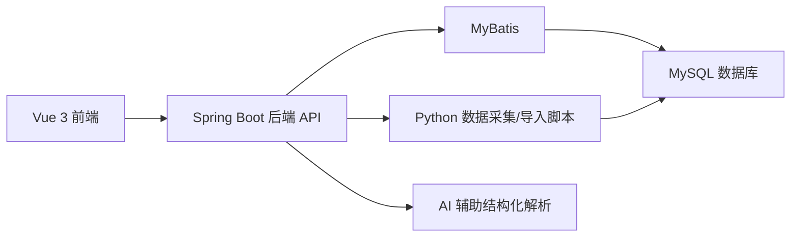

# 视频数据分析平台

一个面向毕业设计场景的全栈视频数据分析系统，覆盖“登录隔离、数据采集、文本/文件智能入库、标准化清洗、可视化分析、报告导出”完整链路。

本项目适用于抖音、Bilibili 等视频平台数据研究，也支持将已有 `.csv`、`.md`、`.txt`、`.log` 等文本资料整理后导入统一数据库进行分析。

## 项目亮点

- 多账号隔离：每个用户拥有独立数据空间，互不干扰
- 数据管理闭环：支持 URL 采集、文本/文件入库、清空数据、错误反馈
- 标准化入库：对不同来源字段做统一映射，并记录低质量/拒绝数据
- 数据分析丰富：热门视频、分类统计、互动效率、用户画像、平台筛选
- 首页性能优化：支持 `/video/dashboard` 聚合接口，减少前端请求开销
- 可视化完整：Vue + ECharts + Three.js，支持 2D/3D 图表切换
- 部署友好：提供本地一键脚本与无 MySQL CLI 初始化脚本

## 系统架构



## 核心功能

### 1. 登录与数据隔离
- 首页提供登录 / 注册入口
- 支持多用户账号
- 数据按账号隔离，适合个人化分析场景

### 2. 数据管理
- URL 采集入口
- 文本/文件智能入库
- CSV 批量导入
- 已导入数据清理
- 导入成功/失败提示与拒绝原因反馈

### 3. 数据分析
- 首页综合总览
- 热门视频排行
- 视频分类统计
- 互动效率分析
- 用户兴趣与画像分析
- 平台筛选与多平台对比

### 4. 智能标准化入库
- 统一字段字典
- 不同平台字段自动映射
- 低质量记录识别
- 拒绝记录与修复建议

## 技术栈

- 前端：`Vue 3`、`Vue Router`、`ECharts`、`Three.js`
- 后端：`Spring Boot 3`、`MyBatis`
- 数据库：`MySQL 8`
- 数据处理：`Python`
- 辅助能力：`GitHub`、`Git`、`PowerShell`

## 目录结构

```text
video-analysis-platform/
├─ frontend/    # Vue3 前端
├─ backend/     # Spring Boot 后端
├─ database/    # MySQL 初始化脚本
├─ spider/      # 采集与解析工具
├─ analysis/    # 分析脚本与报告导出
├─ scripts/     # 一键启动、初始化、自测脚本
└─ docs/        # 部署与规则说明
```

## 快速开始

### 运行环境

- `JDK 17+`
- `Maven 3.9+`
- `Node.js 18+`
- `Python 3.10+`
- `MySQL 8.x`

### 数据库配置

仓库中不再保存明文数据库密码，请先设置环境变量：

```powershell
$env:MYSQL_USER="root"
$env:MYSQL_PASSWORD="你的MySQL密码"
```

### 推荐启动方式

#### 方式一：一键全自动

```powershell
.\OneClick_Full_Auto_Launch.bat
```

#### 方式二：无 MySQL CLI 初始化 + 自测

```powershell
.\OneClick_NoCLI_Init_Test.bat
```

#### 方式三：手动启动

后端：

```powershell
cd backend
mvn spring-boot:run
```

前端：

```powershell
cd frontend
npm install
npm run dev
```

默认访问地址：

- 前端首页：`http://localhost:5173/`
- 后端接口：`http://localhost:8080/`

## 默认账号

- 测试账号：`demo`
- 测试密码：`123456`

也可以直接注册新账号进入自己的数据空间。

## 项目文档

- [部署与使用手册](./docs/部署与使用手册.md)
- [系统概要设计文档](./docs/系统概要设计文档.md)
- [数据库设计文档](./docs/数据库设计文档.md)
- [标准化字段字典与入库判定规则（最小可用版）](./docs/标准化字段字典与入库判定规则_最小可用版.md)
- [P0实施包（SQL与接口样例）](./docs/P0实施包_SQL与接口样例.md)

可选性能 SQL：
- `database/upgrade_performance_light.sql`（轻量索引增强，不改业务功能）
- `database/cleanup_optional_legacy_tables.sql`（历史原始表重命名归档，可回退）

脚本分层说明：
- `scripts/README.md`（主链路脚本与历史脚本）

## 仓库说明

- 当前仓库建议作为“源码仓库”使用
- 自动生成的分析报告、日志、构建产物已默认忽略
- 如需继续提交，请直接使用正常 Git 命令：

```powershell
git add .
git commit -m "你的提交说明"
git push
```
