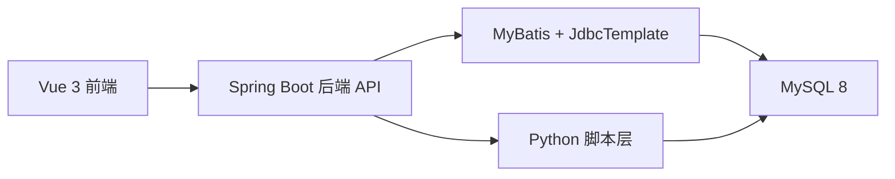

# 系统概要设计文档

更新时间：2026-04-20

## 1. 系统目标

本系统面向“视频平台数据分析”毕业设计场景，提供从数据导入到可视化分析的完整流程，核心目标如下：

1. 支持多账号隔离，每个用户拥有独立数据空间。
2. 支持“观众 / 内容创作者”双身份注册与差异化首页入口。
3. 支持多来源数据导入（URL、文本、文件）并进行标准化入库。
4. 提供可视化分析能力（2D ECharts + 3D Three.js）。
5. 提供自动化部署、自测与报告导出能力。

## 2. 总体架构

技术栈：

- 前端：Vue 3 / Vue Router / ECharts / Three.js
- 后端：Spring Boot 3 / MyBatis / JdbcTemplate
- 数据库：MySQL 8
- 脚本：PowerShell + Python

## 3. 模块划分

## 3.1 前端模块

主要页面与路由（`frontend/src/router/index.js`）：

1. `/`：登录注册页（`AuthLandingView.vue`）
2. `/creator`：创作者中心（`CreatorStudioView.vue`，仅内容创作者可访问）
3. `/dashboard`：首页总览（`HomeView.vue`）
4. `/hot`：热门视频（`HotVideoView.vue`）
5. `/category`：分类统计（`CategoryView.vue`）
6. `/trend`：互动效率（`TrendView.vue`）
7. `/user`：用户分析（`UserView.vue`）
8. `/crawler`：数据管理（`CrawlerView.vue`）

通用能力：

- 全局加载条（`composables/loadingBar.js`）
- 通知反馈（`ToastCenter.vue` + `notify.js`）
- 平台筛选器（`platformFilter.js`）

## 3.2 后端模块

控制器（`backend/src/main/java/com/video/analysis/controller`）：

1. `AuthController`：注册、登录、登出、会话校验
2. `VideoController`：总览、热门、分类、互动、平台对比、来源追踪、创作者中心
3. `CrawlerController`：URL 采集、文本/文件导入、拒绝记录、清理数据
4. `HealthController`：健康检查

服务层：

1. `VideoService` / `VideoServiceImpl`
2. `CrawlerService` / `CrawlerServiceImpl`
3. `AiImportExtractor`（AI 辅助结构化提取）

安全相关：

1. `AuthInterceptor` + `AuthContext`：鉴权与用户上下文
2. `AuthServiceImpl`：登录限流、会话管理、密码升级
3. `SecurityHeadersFilter`：安全响应头
4. `CorsConfig`：可配置来源白名单

## 3.3 数据与脚本模块

1. `database/init.sql`：基础建库建表脚本
2. `scripts/init_db_python.py`：无 mysql CLI 初始化
3. `scripts/full_auto_launch.ps1`：全自动启动链路（初始化、拉起服务、自测、导出）
4. `scripts/smoke_test.py`：冒烟测试
5. `scripts/export_analysis_report.py`：导出 CSV + Markdown 报告
6. `database/upgrade_performance_light.sql`：轻量索引优化脚本（可选执行）
7. `scripts/README.md`：主链路脚本与历史脚本分层说明

## 4. 关键业务流程

## 4.1 登录与数据隔离

1. 用户登录后获取 token。
2. 注册时可选择“观众”或“内容创作者”身份。
3. 若为创作者，需补充创作者名称、主运营平台和主打方向。
4. 后端拦截器解析 token，写入 `AuthContext`。
5. 所有业务查询按 `tenant_user_id` 隔离。

## 4.2 数据导入与标准化

1. 文本/文件导入进入 `CrawlerServiceImpl`。
2. 解析器进行多策略解析（JSON/Markdown 表格/CSV/键值文本）。
3. 可选启用 AI 提取补强结构化数据。
4. 进行质量评分、去重、入库；低质量数据进入拒绝记录。

## 4.3 可视化分析

1. 前端按页面调用 `/video/*` 分析接口。
2. 支持平台筛选（全部或单平台）。
3. 分类统计模块支持 2D/3D 图表切换。
4. 内容创作者登录后默认进入 `/creator`，查看“我的作品总览 + 代表作品 + 内容方向 + 同行对标 + 策略建议”。

## 4.4 轻量性能优化（本次新增）

1. 首页新增聚合接口：`GET /video/dashboard?hotLimit=5`
   - 一次返回 `overview/hotVideos/platformStats/insightCards`
   - 前端首页优先使用该接口，旧接口保留作为回退
2. 导入行为日志新增强度参数：
   - 配置项：`crawler.import.behavior-scale`
   - 默认值：`1.0`（与原行为一致）
   - 小于 1 可显著减少导入时行为日志写入量，提高导入速度

## 5. 一致性检查结论（本次）

检查时间：2026-03-09
结论：总体匹配，存在“已设计未启用”的扩展层。

1. 代码功能与当前运行数据库主链路匹配：
   - `init.sql` + 启动时 `SchemaUpgradeRunner` 可满足现有功能。
2. `database/upgrade_p0_metrics_quality_alert.sql` 属于 P0 扩展设计：
   - 当前后端尚未实现对应 `/metrics`、`/alerts`、`/lineage` API。
   - 数据库中也未默认创建这些扩展表（需手动执行迁移）。
3. 数据库中存在历史原始采集表：
   - `bilibili_video_raw`、`douyin_live_raw`
   - 当前主系统不依赖，不影响运行，可按数据治理策略决定是否保留。
4. 本次轻量性能优化已落地：
   - 首页聚合接口已实现并接入前端。
   - 导入行为日志强度参数已实现（默认不改变功能）。

## 6. 后续文档维护规则（执行约定）

从本次开始，后续每次功能改动按以下顺序同步：

1. 先改代码与 SQL。
2. 同步更新本文档（模块、流程、接口变化）。
3. 同步更新《数据库设计文档》中的表结构和迁移说明。
4. 如涉及部署流程变化，同步更新《部署与使用手册》。

## 13. 2026-04-20 创作者身份与创作者中心（本次）

### 13.1 功能定位

本次新增“双身份账号体系”：

1. 观众：
- 保持现有系统界面与分析逻辑。
- 适合做全平台内容观察、热点研究和用户画像分析。

2. 内容创作者：
- 注册时填写创作者名称、主运营平台、主打方向。
- 登录后默认进入创作者中心。
- 更强调“看自己的内容数据”和“看同行差距”。

### 13.2 前端变更

1. 登录注册页新增身份选择卡片。
2. 选择“内容创作者”后显示扩展注册字段：
- `creatorName`
- `creatorPlatform`
- `creatorFocusCategory`
3. 新增路由 `/creator` 与页面 `CreatorStudioView.vue`。
4. 顶部导航按身份动态生成：
- 创作者账号额外显示“创作者中心”入口。
- 账号区增加角色标识徽标。

### 13.3 后端变更

1. 注册与登录返回的 `user` 信息新增：
- `role`
- `roleLabel`
- `creatorName`
- `creatorPlatform`
- `creatorFocusCategory`
2. 新增接口：
- `GET /video/creator/dashboard`
3. 接口返回内容包括：
- 创作者资料
- 自身作品总览
- 自身代表作品
- 自身分类统计
- 同行作者列表
- 同行基准摘要
- 创作建议列表

### 13.4 设计意义

这次调整使系统不再只是“统一看全站数据”的研究平台，还具备了“面向内容创作者的运营分析入口”。对毕业设计而言，这一变化增强了系统的角色层次、业务完整度和场景针对性，也让“观众视角分析”和“创作者视角分析”形成了更清晰的功能分工。

---

## 7. 2026-03-09 性能优化实现（功能不变）

本次优化目标：在不改变前端功能与接口返回结构的前提下，提高大数据量下的首页承载能力。

### 7.1 后端实现点

1. 首页总览改为“缓存优先 + 实时兜底”
   - `VideoServiceImpl` 先查 `tenant_overview_cache`；
   - 缓存缺失时回退到实时统计并回写缓存。

2. 导入/清空后自动刷新缓存
   - `CrawlerServiceImpl` 在“入库成功”和“清空数据”流程末尾，自动重算当前租户的总览缓存（含全平台与分平台）。

3. 启动时自动补齐与预热
   - `SchemaUpgradeRunner` 启动时自动建 `tenant_overview_cache`，并对现有租户预热缓存。

4. 用户画像查询减负
   - `VideoMapper.xml` 中 `selectUserInterest` 的 `top_users` 子查询改为“仅在平台筛选时联表 video”；
   - 新增索引 `idx_behavior_tenant_user_video`，提升租户用户聚合与回表效率。

### 7.2 效果（本机实测）

- `/video/overview`：由秒级下降至毫秒级；
- `/video/dashboard`：由秒级下降至百毫秒级；
- `/video/insight`：由秒级下降至百毫秒级；
- `/video/user`：仍是当前主要慢接口，但已有明显下降，后续可继续做预聚合优化。

## 8. 2026-03-09 清理链路稳定性修复

1. `clear-data` 清理顺序调整为先删 `import_reject_record`，再删 `import_job`，避免在不同数据库约束策略下出现偶发失败。
2. `CrawlerController` 的异常响应增加简要 `output` 原因（异常类型 + message），便于前端排障，不影响现有接口结构。
3. 清理链路已实测：导入后清理可正确将租户数据与总览缓存同步归零。

## 9. 2026-03-10 长任务成功率修复

1. 前端长任务接口（URL 采集、写入模拟、文本导入、文件导入、清理数据）统一使用 `timeout: 0`，避免被外部 10 秒超时配置中断。
2. `start_frontend.ps1` 启动时强制设置 `VITE_API_TIMEOUT_MS=0`，降低环境变量导致的请求超时风险。
3. 大数据场景实测：
   - `BiliBili_data.csv` 导入约 113~180 秒；
   - 同量级清理约 170 秒。
   因此属于分钟级任务，执行期间需保持页面不关闭并等待成功提示。

## 10. 2026-03-10 导入/清理稳定性二次优化（已落地）

本次在不改变功能入口的前提下，针对“大文件导入和清理难成功”做了稳定性优化：

1. 导入行为日志降载
- 默认 `crawler.import.behavior-scale` 从 `1.0` 调整为 `0.35`。
- 新增 `crawler.import.behavior-max-rows-per-import`（默认 `300000`），限制单次导入生成的行为日志上限。
- 结果：保留视频主数据全量导入，同时显著降低 `user_behavior` 写入量。

2. 清理链路改为稳态执行
- `user_behavior` 改为分批删除（`LIMIT 50000` 循环），降低长事务和锁竞争风险。
- 取消清理前的大量计数扫描，减少无效耗时。

3. 概览缓存策略优化
- 导入/清理后改为“缓存失效”而非“同步全量重算”。
- 避免在写入事务尾部做重计算导致请求拖长。

4. 实测结果（同一份大文件）
- 文件：`BiliBili_data.csv`（约 11386 条有效视频）
- 优化前：导入约 134 秒，清理约 206 秒
- 优化后：导入约 16 秒，清理约 11 秒

5. 兼容性说明
- 接口路径与请求参数保持不变。
- 导入质量规则、拒绝记录与平台分析功能保持可用。

## 11. 2026-03-10 用户画像标签修复（二次）

本次针对“用户画像几乎全部落在同一标签”的问题进行了规则与数据生成双修复：

1. 行为日志生成策略优化（`CrawlerServiceImpl`）
- 行为生成不再仅按固定对数比例推导；改为“源数据互动率 + 用户行为档位”联合建模。
- 新增五类行为档位（轻浏览/稳态/点赞驱动/高互动/高频），按租户+作者哈希稳定分配。
- 缩放后使用确定性小数进位策略，避免 `like/comment` 被大量舍入为 0。

2. 画像标签判定优化（`VideoMapper.xml`）
- 调整标签判定顺序，优先识别跨平台探索与高频活跃，再判断高互动。
- 调整高互动与点赞驱动阈值，降低标签掩盖效应。

3. 实测结果
- 修复前：高互动讨论型单一占比（100%）。
- 修复后：同批数据可稳定分出 `steady_viewer / like_driven / high_interaction_discuss` 多标签结构。

## 2026-03-10 用户画像标签修复（三次）

本次修复目标：解决“历史行为数据分布极端时，用户画像全部落在 high_interaction_discuss”的问题。

实现要点：
1. selectUserInterest 新增 user_metric、user_rank 两层 CTE，统一计算 avg_daily_actions / like_rate / comment_rate / interaction_rate 以及各项分位值。
2. profile_label 判定由固定阈值升级为“固定阈值 + 分位数阈值”组合，避免单一标签覆盖。
3. /video/user 接口结构保持不变，仅优化标签判定逻辑。

实测结果（本地历史数据）：
- 修复前：high_interaction_discuss 约 100%
- 修复后：稳定分化为 steady_viewer / high_frequency_active / high_interaction_discuss 多标签结构。

## 12. 2026-03-10 最小风险稳定性修复（本次）

本次按“先入库稳定、再口径一致、再安全与性能”的顺序落地，功能入口保持不变。

1. 入库解析稳定性（`CrawlerServiceImpl`）
- Markdown 表头新增标准化映射，支持中英文混合表头（如“标题（title）/来源平台/播放量(次)”）。
- CSV 解析升级为记录级解析，支持引号包裹的多行字段，避免大文件中字段错位。
- 叙述文本正则提取增加异常保护，单条模式异常不会中断整次导入。
- 行级字段映射改为“单次归一化后复用”，降低大批量导入时的重复开销。

2. 统计口径一致性（`VideoMapper.xml` + `SchemaUpgradeRunner`）
- 总览 `commentCount` 与分类统计统一为 `video.comment_count` 口径，避免首页与分析页对不齐。
- 总览缓存重建同步改为同一口径，保证缓存命中与实时查询结果一致。

3. 认证安全与会话写放大优化（`AuthController` + `AuthServiceImpl`）
- 仅在可信代理来源下解析 `X-Forwarded-For/X-Real-IP`，降低伪造源 IP 风险。
- 登录失败内存状态加入按大小/时间/操作次数触发的过期清理，避免长时间运行后 map 膨胀。
- `app_session.last_active_at` 改为“降频更新”（2 分钟触发一次），减少高频接口写压力。

4. 前端包体轻量化（`EChartPanel.vue`）
- 图表组件改为按需动态加载 ECharts 核心模块，降低主包压力。
- 新增 `frontend/src/utils/echarts.js` 统一注册图表组件。

## 2026-04-20 补充：创作者资料可编辑与导航重排

1. 新增接口：`POST /video/creator/profile`
2. 入参：`creatorPlatform`、`creatorFocusCategory`
3. 作用：内容创作者可在创作者中心直接修改“主运营平台 / 主打方向”，保存后即时生效
4. 认证：需要登录且账号角色为 `creator`
5. 前端导航调整：主导航与平台筛选拆分为两层，减轻顶部拥挤
